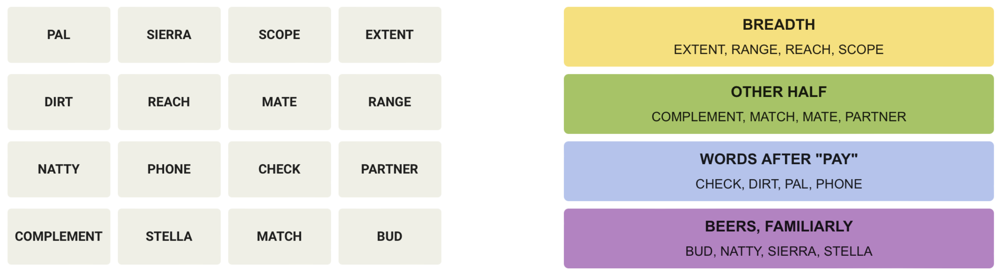

# Word Game Bench
Word Game Bench is a fun way to evaluate language models. The goal is to provide a standardized way to evaluate language models on word puzzle games, and to continually publish and maintain a leaderboard of the models' performance on new daily puzzles.

View the live leaderboard at [wordgamebench.github.io](https://wordgamebench.github.io)

## Which games are included?

[Wordle](https://www.nytimes.com/games/wordle/index.html) is a word puzzle game where the player has to guess a 5-letter word in 6 attempts. For each letter in the guessed word, the player receives feedback on whether the letter is in the target word and in the correct position. For example, if the target word is "plane" and the player guesses "flops", then:


indicates that the letter "L" is in the correct position, and the letter "P" is in the target word but in the wrong position, and the letters "F", "O", and "S" are not in the target word. Since we are working with language models, we encode this visualized information as a JSON object.

[Connections](https://www.nytimes.com/games/connections) is a word association game where the player has to group 16 words into 4 categories of 4 words each. The player doesn't know the categories beforehand, and has to group the shuffled words based on their associations. For example, on the left is a grid of unlabeled words, and on the right is the categorization of the words in their underlying categories:


The job of the player is <b>not</b> to guess the actual categories, but rather which 4 words go together without knowing the categories upfront. Nevertheless, notice that there are many adversarial examples where a word can belong to multiple categories, such as the words "pal" and "bud" being similar to "partner" and "mate", although belonging to 3 different categories.

If you are interested in playing the games yourself, please visit the official <a href="https://www.nytimes.com/crosswords" target="_blank">New York Times</a> website.

Moreover, if you'd like to see the full logs of the gameplay for today's puzzles, please navigate to the <b>Daily Puzzle</b> tab, and select a model from the dropdown menu.

## What does this benchmark measure?

While there are plethora of other benchmarks out there being used in the academic literature (e.g. <a href="https://arxiv.org/abs/2009.03300" target="_blank">MMLU</a>, <a href="https://arxiv.org/abs/1905.07830" target="_blank">HellaSwag</a>, <a href="https://arxiv.org/abs/2107.03374v2">HumanEval</a>), I believe <b>Word Game Bench</b> offers unique advantages compared to the existing evaluations, so let us <i>delve</i> into them:

First, instead of prompting the model once and getting back a response, in this benchmark the model <b>interacts</b> with the game and produces its final output as a result of its own actions/predictions in the previous steps of the game, as well as the feedback it receives from the environment.

Next, language models rely on tokenizers to convert the input text into a format that the model can understand. Nonetheless, despite the impressive results from language models today, <b>tokenization</b> is the core issue why they struggle with the simplest of tasks such as reversing a string, doing basic arithmetic, or spelling out a word (how many r's are in 🍓?). Andrej Karpathy has an awesome <a href="https://x.com/karpathy/status/1816637781659254908" target="_blank">post</a> drawing analogies between tokens and hieroglyphs. With that said, I believe Wordle neatly attacks this pain point of LLMs -- by providing character level feedback for the guessed word, the model needs to reason how to incorporate this new knowledge into making a next guess satisfying the constraints of the environment.

On the other end of the spectrum, Connections is a game that requires the model to reason about the relationships between words and group them into categories. This is a more <b>abstract</b> task that requires the model to understand the semantics of the words and their relationships.

Lastly, we don't have to worry about test set <b>leakage</b>. In the case of Connections, each new daily puzzle is crafted by a human expert, so it is very unlikely that the model has seen the exact same puzzle before. And in the case of Wordle, the target word is randomly selected from a list of 5-letter words, hence why this is not a concern either.

This is a continually updated benchmark, and there is no intention of maintaining a fixed test set for reproducibility purposes. Admittedly, this is a decision stemming from <a href="https://arxiv.org/abs/2211.03186" target="_blank">my own</a> research interests related to continual/lifelong learning. Sadly, I don’t think there are many continually updated benchmarks for evaluating large language models, with a notable exception of <a href="https://chat.lmsys.org" target="_blank">LMSYS Chatbot Arena</a>. Word Game Bench is a further step in that direction, and I hope it will inspire others to consider this route.

## Due diligence

This project only serves as a fun way to benchmark language models, and is <b>educational</b> in nature. The project does not aim to provide any commercial services or products, and only serves as a platform to better understand the capabilities of language models on word puzzle games.

The project <b>does not release</b> an archive of New York Times' puzzles, and only publishes the cumulative results of the models' performance, as well as the interactions of the model with the current daily puzzle. Moreover, the project <b>does not train</b> any models on this proprietary data.

Lastly, the project <b>does not publish</b> any clones of the original games with the goal of diverting traffic. In fact, the project encourages the users to play the games on the official <a href="https://www.nytimes.com/crosswords" target="_blank">New York Times</a> website, as I myself do.

## Who maintains this project?

This project is maintained by <a href="http://zafstojano.com" target="_blank">Zafir Stojanovski</a>, a machine learning engineer with a passion for fair evals. If you would like to give me feedback, feel free to e-mail me at <a href="mailto:zaf.stojano@gmail.com">zaf.stojano@gmail.com</a> or reach out on Twitter/X <a href="https://x.com/zafstojano" target="blank">@zafstojano</a>.

If you like the project and would like to help out, please consider <a href="https://buymeacoffee.com/starzmustdie" target="_blank">buying me a coffee</a> to keep the evals running.

Lastly, if you'd like to cite this project, please use the following:

```
@misc{AGI-BY-2028,
  author = {Zafir Stojanovski},
  title = {Do you even "Word Game Bench" bro?},
  year = {2024},
  howpublished = {\url{https://wordgamebench.github.io}},
  note = {💛💚💙💜 Word Game Bench is nothing without its single u̶n̶e̶m̶p̶l̶o̶y̶e̶d̶ maintainer 💜💙💚💛}
}
```
